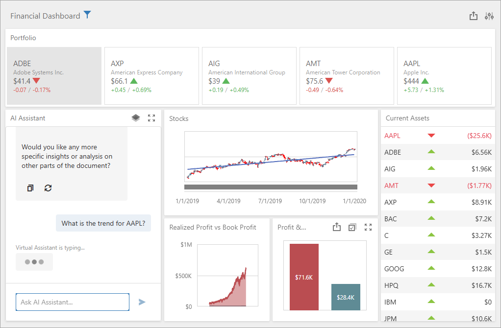
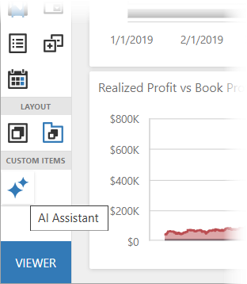

<!-- default badges list -->

[](https://supportcenter.devexpress.com/ticket/details/T1279614)
[](https://docs.devexpress.com/GeneralInformation/403183)
[](#does-this-example-address-your-development-requirementsobjectives)
<!-- default badges end -->
# DevExpress BI Dashboard for ASP.NET Core — Azure OpenAI-based AI Assistant

Sample ASP.NET Core application using DevExpress BI Dashboard with an integrated AI Assistant.  

User requests and AI assistant responses are displayed on-screen (within the DevExtreme [`dxChat`](https://js.devexpress.com/jQuery/Documentation/24_2/ApiReference/UI_Components/dxChat/) component). The AI Assistant is implemented as a [custom BI Dashboard item](https://docs.devexpress.com/Dashboard/117546/web-dashboard/advanced-customization/create-a-custom-item) (based on the `dxChat` widget).



To answer user questions, the AI Assistant analyzes all data displayed within the DevExpress BI Dashboard. You can filter available data if you select a specific Dashboard item. Click the **Select widget** button in the AI Assistant custom item caption and select the desired widget. Note: updates to parameters/master filters or other data changes automatically trigger recreation of the AI Assistant.

The application exports the current dashboard data to an Excel file, uploads it to Azure OpenAI, and creates a chat agent using the [Azure OpenAI Responses API](https://learn.microsoft.com/en-us/azure/foundry/openai/how-to/responses?tabs=csharp). The agent uses the Code Interpreter tool to analyze the data.


## Implementation Details

### Add Personal Keys

> [!NOTE]  
> DevExpress AI-powered extensions follow the "bring your own key" principle. DevExpress does not offer a REST API and does not ship any built-in LLMs/SLMs. You need an active Azure/Open AI subscription to obtain the REST API endpoint, key, and model deployment name. These variables must be specified at application startup to register AI clients and enable DevExpress AI-powered Extensions in your application.

Create an Azure OpenAI resource in the Azure portal. Refer to the following help topic for additional information in this regard: [Microsoft - Create and deploy an Azure OpenAI Service resource](https://learn.microsoft.com/en-us/azure/ai-services/openai/how-to/create-resource?pivots=web-portal).

Once you obtain a private endpoint and API key, register them as `AZURE_OPENAI_ENDPOINT` and `AZURE_OPENAI_APIKEY` environment variables. Open [EnvSettings.cs](./CS/EnvSettings.cs) to review the code that reads these settings. `DeploymentName` is the name of your Azure model deployment. The model must support the Responses API and the Code Interpreter tool (for example, `gpt-5.4`): 

```cs
public static class EnvSettings {
    public static string AzureOpenAIEndpoint { get { return Environment.GetEnvironmentVariable("AZURE_OPENAI_ENDPOINT"); } }
    public static string AzureOpenAIKey { get { return Environment.GetEnvironmentVariable("AZURE_OPENAI_APIKEY"); } }
    public static string DeploymentName { get { return "gpt-5.4"; } }
}
```

Files to Review: 
- [EnvSettings.cs](./CS/EnvSettings.cs)

### Register AI Services

Add the following code to the _Program.cs_ file to register AI services in your application:

```cs
using Azure;
using Azure.AI.OpenAI;
using DashboardAIAssistant.Services;
using Microsoft.Extensions.Logging;
// ...
var azureOpenAIClient = new AzureOpenAIClient(
    new Uri(EnvSettings.AzureOpenAIEndpoint),
    new AzureKeyCredential(EnvSettings.AzureOpenAIKey));

// Create a Responses API agent (with a Code Interpreter tool) for each chat.
builder.Services.AddSingleton<AgentFactory>(sp =>
    new(azureOpenAIClient, EnvSettings.DeploymentName, sp.GetRequiredService<ILogger<AgentFactory>>()));

// ...
```

Files to Review: 
- [Program.cs](./CS/Program.cs)

### AI Assistant Provider

On the server side, the `AIDashboardChatService` service manages chat sessions:

```cs
public interface IAIDashboardChatService {
    IChatResponseProvider GetChatProvider(string sessionId);
    Task<string> OpenChatAsync(Stream excelStream);
    Task CloseChatAsync(string sessionId);
}
```

The `AgentFactory` class creates the agent that answers user questions. When a chat opens, `AgentFactory.CreateChatProviderAsync`:

1. Uploads the exported Excel file to Azure OpenAI.
2. Creates a Responses API agent with the Code Interpreter tool. The tool runs Python against the data to compute summaries, calculations, filters, and trends.
3. Starts a session that preserves the conversation history.
4. Returns an `IChatResponseProvider`.

`AIDashboardChatService` stores each provider by session id and deletes the uploaded file when the chat is closed.

For information on OpenAI Responses API, refer to the following documents: 
- [Azure OpenAI Responses API](https://learn.microsoft.com/en-us/azure/foundry/openai/how-to/responses?tabs=csharp)
- [OpenAI Responses API](https://developers.openai.com/api/reference/responses/overview)
- [Code Interpreter tool](https://developers.openai.com/api/docs/guides/tools-code-interpreter)

You can review and tailor the agent instructions in the following file: [AgentInstructions.cs](./CS/Services/AgentInstructions.cs).

Files to Review: 
- [IAIDashboardChatService.cs](./CS/Services/IAIDashboardChatService.cs)
- [AIDashboardChatService.cs](./CS/Services/AIDashboardChatService.cs)
- [AgentFactory.cs](./CS/Services/AgentFactory.cs)
- [AgentInstructions.cs](./CS/Services/AgentInstructions.cs)

### Create an AI Assistant Custom Item

This example implements a [custom item](https://docs.devexpress.com/Dashboard/117546/web-dashboard/advanced-customization/create-a-custom-item) based on the [`dxChat`](https://js.devexpress.com/jQuery/Documentation/Guide/UI_Components/Chat/Overview/) component.

For instructions on how to implement custom BI Dashboard items, refer to the following tutorials: [Create a Custom Item for the Web Dashboard](https://docs.devexpress.com/Dashboard/117546/web-dashboard/advanced-customization/create-a-custom-item).

For our **AI Assistant** custom item implementation, review the following file: [aiChatCustomItem.js](./CS/wwwroot/js/aiChatCustomItem.js).

Additional logic for the custom item is implemented in the [Index.cshtml](./CS/Pages/Index.cshtml) file. The `itemCaptionToolbarUpdated` event is used to add a **Select Widget** button to the item's caption. This button allows users to select a BI Dashboard item and narrow data available to the AI Assistant. The `DashboardInitialized` event handler implements _one AI Assistant per dashboard_ logic.

Files to Review:
- [Index.cshtml](./CS/Pages/Index.cshtml)
- [aiChatCustomItem.js](./CS/wwwroot/js/aiChatCustomItem.js)

### Register the Custom Item Extension

Register the custom item extension in the Web Dashboard:

```html
<script type="text/javascript">
    // ...
    function handleBeforeRender(dashboardControl) {
        chatAIItem = new AIChatItem(dashboardControl);
        dashboardControl.registerExtension(chatAIItem);
        // ...
    }
    // ...
</script>

<div style="position: relative; height: calc(100vh - 55px);">
@(Html.DevExpress().Dashboard("dashboardControl1")
    .ControllerName("DefaultDashboard")
    .OnBeforeRender("handleBeforeRender")
    .OnDashboardInitialized("handleDashboardInitialized")
)
</div>
```

Once you register the extension, an AI Assistant icon appears within the Dashboard Toolbox:



Click the item to add an AI Assistant item to the dashboard. Only one AI Assistant item is available per BI Dashboard. You can ask the assistant questions in Viewer mode.

File to Review: 
- [Index.cshtml](./CS/Pages/Index.cshtml)

### Access the Assistant

The [`AIChatController`](./CS/Controllers/AIChatController.cs) exposes the endpoints that the custom item calls:

- `CreateChat` — exports the current dashboard data to an Excel file and calls `OpenChatAsync` to upload it and start a chat session. Returns the session id.
- `GetAnswer` — resolves the session's `IChatResponseProvider` and forwards the question to the agent.
- `CloseChat` — calls `CloseChatAsync` to end the session and delete the uploaded file.

On the client, the custom item closes the current chat whenever the dashboard is initialized or its [dashboard state](https://docs.devexpress.com/Dashboard/DevExpress.DashboardCommon.DashboardState) changes (for example, after a master filter or parameter update) and opens a new one on the next question — so the assistant always works with up-to-date data.

Files to Review: 

- [aiChatCustomItem.js](./CS/wwwroot/js/aiChatCustomItem.js)
- [AIDashboardChatService.cs](./CS/Services/AIDashboardChatService.cs)
- [AIChatController.cs](./CS/Controllers/AIChatController.cs)

### Communicate with the Assistant

Each time a user sends a message, the [`onMessageEntered`](https://js.devexpress.com/jQuery/Documentation/24_2/ApiReference/UI_Components/dxChat/Configuration/#onMessageEntered) event handler passes the request to the assistant:

```js
// ...
getAnswer(chatId, question) {
    const formData = new FormData();
    formData.append('chatId', chatId);
    formData.append('question', question);
    return this._tryFetch(async () => {
        const response = await fetch('/AIChat/GetAnswer', {
            method: 'POST',
            body: formData
        });
        return await response.text();
    }, 'GetAnswer');
}
// ...
async getAIResponse(question) {
    this.lastUserQuery = question;

    if(!this.chatId)
        this.chatId = await this.createChat(this.dashboardControl.getDashboardId(), this.dashboardControl.getDashboardState());
    if(this.chatId)
        return await this.getAnswer(this.chatId, question);
};
// ...
async onMessageEntered(e) {
    const instance = e.component;
    this.component.option('alerts', []);
    instance.renderMessage(e.message);
    instance.option({ typingUsers: [assistant] });
    const userInput = e.message.text + ((this.model.selectedSheet && "\nDiscuss item " + this.model.selectedSheet)
        || "\nLet's discuss all items");
    const response = await this.getAIResponse(userInput);
    this.renderAssistantMessage(instance, response);
}
```

[`AIChatController.GetAnswer`](./CS/Controllers/AIChatController.cs) receives answers from the assistant.

## Files to Review

- [Program.cs](./CS/Program.cs)
- [Index.cshtml](./CS/Pages/Index.cshtml)
- [aiChatCustomItem.js](./CS/wwwroot/js/aiChatCustomItem.js)
- [AgentFactory.cs](./CS/Services/AgentFactory.cs)
- [AIDashboardChatService.cs](./CS/Services/AIDashboardChatService.cs)
- [IAIDashboardChatService.cs](./CS/Services/IAIDashboardChatService.cs)
- [AIChatController.cs](./CS/Controllers/AIChatController.cs)
- [AgentInstructions.cs](./CS/Services/AgentInstructions.cs)

## Documentation

- [AI Integration](https://docs.devexpress.com/CoreLibraries/405204/ai-powered-extensions)
- [Create a Custom Item for the Web Dashboard](https://docs.devexpress.com/Dashboard/117546/web-dashboard/advanced-customization/create-a-custom-item)
- [Getting Started with JavaScript/jQuery Chat](https://js.devexpress.com/jQuery/Documentation/Guide/UI_Components/Chat/Getting_Started_with_Chat/)

## More Examples

- [Reporting for ASP.NET Core - Integrate AI Assistant based on Azure OpenAI](https://github.com/DevExpress-Examples/web-reporting-integrate-ai-assistant)

<!-- feedback -->
## Does This Example Address Your Development Requirements/Objectives?

[](https://www.devexpress.com/support/examples/survey.xml?utm_source=github&utm_campaign=asp-net-core-dashboard-integrate-ai-assistant&~~~was_helpful=yes) [](https://www.devexpress.com/support/examples/survey.xml?utm_source=github&utm_campaign=asp-net-core-dashboard-integrate-ai-assistant&~~~was_helpful=no)

(you will be redirected to DevExpress.com to submit your response)
<!-- feedback end -->
