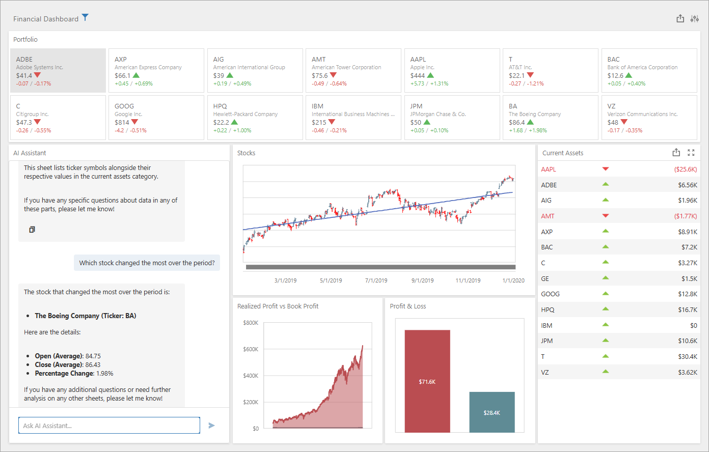

<!-- default badges list -->

[](https://supportcenter.devexpress.com/ticket/details/T1279614)
[](https://docs.devexpress.com/GeneralInformation/403183)
[](#does-this-example-address-your-development-requirementsobjectives)
<!-- default badges end -->
# DevExpress BI Dashboard for ASP.NET Core — Azure OpenAI-based AI Assistant

Sample ASP.NET Core application using DevExpress BI Dashboard with an integrated AI Assistant.  

User requests and AI assistant responses are displayed on-screen (within the DevExtreme [`dxChat`](https://js.devexpress.com/jQuery/Documentation/24_2/ApiReference/UI_Components/dxChat/) component). The AI Assistant is implemented as a [custom BI Dashboard item](https://docs.devexpress.com/Dashboard/117546/web-dashboard/advanced-customization/create-a-custom-item) (based on the `dxChat` widget).




To answer user questions, the AI Assistant reviews/analyzes all data displayed within the DevExpress BI Dashboard. You can filter available data if you select a specific Dashboard item. Click the **Select widget** button in the AI Assistant custom item caption and select the desired widget. Note: updates to parameters/master filters or other data changes automatically trigger recreation of the AI Assistant. 

**AI Assistant initialization takes time. The Assistant is ready for interaction once Microsoft Azure scans the source document (on the server side).** 

> [!Note]
> We use the following versions of the `Microsoft.Extensions.AI.*` libraries in our source code:
>
> - Microsoft.Extensions.AI.Abstractions: **9.5.0**
> - Microsoft.Extensions.AI: **9.5.0**
> - Microsoft.Extensions.AI.OpenAI: **9.5.0-preview.1.25265.7**
>
> We cannot guarantee compatibility with other versions. 

## Implementation Details

### Add Personal Keys

> [!NOTE]  
> DevExpress AI-powered extensions follow the "bring your own key" principle. DevExpress does not offer a REST API and does not ship any built-in LLMs/SLMs. You need an active Azure/Open AI subscription to obtain the REST API endpoint, key, and model deployment name. These variables must be specified at application startup to register AI clients and enable DevExpress AI-powered Extensions in your application.

Create an Azure OpenAI resource in the Azure portal to use AI Assistants for DevExpress BI Dashboard. Refer to the following help topic for additional information in this regard: [Microsoft - Create and deploy an Azure OpenAI Service resource](https://learn.microsoft.com/en-us/azure/ai-services/openai/how-to/create-resource?pivots=web-portal).

Once you obtain a private endpoint and API key, register them as `AZURE_OPENAI_ENDPOINT` and `AZURE_OPENAI_APIKEY` environment variables. Open [EnvSettings.cs](./CS/EnvSettings.cs) to review the code that reads these settings. `DeploymentName` in this file represents the name of your Azure model, for example, GPT4o: 

```cs
public static class EnvSettings {
    public static string AzureOpenAIEndpoint { get { return Environment.GetEnvironmentVariable("AZURE_OPENAI_ENDPOINT"); } }
    public static string AzureOpenAIKey { get { return Environment.GetEnvironmentVariable("AZURE_OPENAI_APIKEY"); } }
    public static string DeploymentName { get { return "GPT4o"; } }
}
```

Files to Review: 
- [EnvSettings.cs](./CS/EnvSettings.cs)

### Register AI Services

Add the following code to the _Program.cs_ file to register AI services in your application:

```cs
using DevExpress.AIIntegration;
using Azure;
using Azure.AI.OpenAI;
using Microsoft.Extensions.AI;
using System;
// ...
var azureOpenAIClient = new AzureOpenAIClient(
    new Uri(EnvSettings.AzureOpenAIEndpoint),
    new AzureKeyCredential(EnvSettings.AzureOpenAIKey));

var chatClient = azureOpenAIClient.GetChatClient(EnvSettings.DeploymentName).AsIChatClient();

builder.Services.AddDevExpressAI(config =>
{
    config.RegisterOpenAIAssistants(azureOpenAIClient, EnvSettings.DeploymentName);
});
// ...
```

>[!NOTE]
> Availability of Azure Open AI Assistants depends on region. Refer to the following article for additional information: [Assistants (Preview)](https://learn.microsoft.com/en-us/azure/ai-services/openai/concepts/models?tabs=global-standard%2Cstandard-chat-completions#assistants-preview).

Files to Review: 
- [Program.cs](./CS/Program.cs)

### AI Assistant Provider
 
On the server side, the `AIAssistantProvider` service manages assistants. An `IAIAssistantFactory` instance creates assistants with keys specified in previous steps.
 
```cs 
public interface IAIAssistantProvider {
    Task<string> CreateAssistant(Stream fileContent, string prompt);
    IAIAssistant GetAssistant(string assistantId);
    void DisposeAssistant(string assistantId);
}
```

The `AIAssistantCreator.CreateAssistantAndThreadAsync` method uploads a file to OpenAI, configures tool resources, creates an assistant with specified instructions and tools, initializes a new thread, and returns the assistant and thread IDs. The generated assistant and thread IDs are then passed to the `IAIAssistantFactory.GetAssistant` method, which returns an `IAIAssistant` instance. The created instance is added to the application's assistant collection and is referenced by its unique name.

For information on OpenAI Assistants, refer to the following documents: 
- [OpenAI Assistants API overview](https://platform.openai.com/docs/assistants/overview)
- [Azure OpenAI: OpenAI Assistants client library for .NET](https://learn.microsoft.com/en-us/dotnet/api/overview/azure/ai.openai.assistants-readme?view=azure-dotnet-preview)
- [OpenAI .NET API library](https://github.com/openai/openai-dotnet)

You can review and tailor AI assistant instructions in the following file: [AssistantHelper.cs](./CS/Services/AssistantHelper.cs).

Files to Review: 
- [IAIAssistantProvider.cs](./CS/Services/IAIAssistantProvider.cs)
- [AIAssistantProvider.cs](./CS/Services/AIAssistantProvider.cs)
- [AIAssistantProvider.cs](./CS/Services/AIAssistantProvider.cs)
- [AIAssistantCreator.cs](./CS/Services/AIAssistantCreator.cs)

### Create an AI Assistant Custom Item

This example implements a [custom item](https://docs.devexpress.com/Dashboard/117546/web-dashboard/advanced-customization/create-a-custom-item) based on the [`dxChat`](https://js.devexpress.com/jQuery/Documentation/Guide/UI_Components/Chat/Overview/) component.

For instructions on how to implement custom BI Dashboard items, refer to the following tutorials: [Create a Custom Item for the Web Dashboard](https://docs.devexpress.com/Dashboard/117546/web-dashboard/advanced-customization/create-a-custom-item).

For our **AI Assistant** custom item implementation, review the following file: [aiChatCustomItem.js](./CS/wwwroot/js/aiChatCustomItem.js).

Additional logic for the custom item is implemented in the [Index.cshtml](./CS/Pages/Index.cshtml) file. The `itemCaptionToolbarUpdated` event is used to add a **Select Widget** button to the item's caption. This button allows users to select a BI Dashboard item and narrow data available to the AI Assistant. The `DashboardInitialized` event handler implements _one AI Assistant per dashboard_ logic.

Files to Review:
- [Index.cshtml](./CS/Pages/Index.cshtml)
- [aiChatCustomItem.js](./CS/wwwroot/js/aiChatCustomItem.js)

### Register the Custom Item Extension

Register the custom item extension in the Web Dashboard:

```html
<script type="text/javascript">
    // ...
    function handleBeforeRender(dashboardControl) {
        chatAIItem = new AIChatItem(dashboardControl);
        dashboardControl.registerExtension(chatAIItem);
        // ...
    }
    // ...
</script>

<div style="position: relative; height: calc(100vh - 55px);">
@(Html.DevExpress().Dashboard("dashboardControl1")
    .ControllerName("DefaultDashboard")
    .OnBeforeRender("handleBeforeRender")
    .OnDashboardInitialized("handleDashboardInitialized")
)
</div>
```

Once you register the extension, an AI Assistant icon will appear within the Dashboard Toolbox:


Click the item to add an AI Assistant item to the dashboard. Only one AI Assistant item is available per BI Dashboard. You can ask the assistant questions in Viewer mode.

File to Review: 
- [Index.cshtml](./CS/Pages/Index.cshtml)

### Access the Assistant

Each time a Dashboard is initialized or its [dashboard state](https://docs.devexpress.com/Dashboard/DevExpress.DashboardCommon.DashboardState) changes, the application exports Dashboard data to an Excel spreadsheet and creates a new Assistant (so that the AI Assistant always processes up-to-date data).

Files to Review: 

- [aiChatCustomItem.js](./CS/wwwroot/js/aiChatCustomItem.js)
- [AIAssistantProvider.cs](./CS/Services/AIAssistantProvider.cs)
- [AIChatController](./CS/Controllers/AIChatController.cs)

### Communicate with the Assistant

Each time a user sends a message, the [`onMessageEntered`](https://js.devexpress.com/jQuery/Documentation/24_2/ApiReference/UI_Components/dxChat/Configuration/#onMessageEntered) event handler passes the request to the assistant:

```js
// ...
getAnswer(chatId, question) {
    const formData = new FormData();
    formData.append('chatId', chatId);
    formData.append('question', question);
    return this._tryFetch(async () => {
        const response = await fetch('/AIChat/GetAnswer', {
            method: 'POST',
            body: formData
        });
        return await response.text();
    }, 'GetAnswer');
}
// ...
async getAIResponse(question) {
    this.lastUserQuery = question;

    if(!this.chatId)
        this.chatId = await this.createChat(this.dashboardControl.getDashboardId(), this.dashboardControl.getDashboardState());
    if(this.chatId)
        return await this.getAnswer(this.chatId, question);
};
// ...
async onMessageEntered(e) {
    const instance = e.component;
    this.component.option('alerts', []);
    instance.renderMessage(e.message);
    instance.option({ typingUsers: [assistant] });
    const userInput = e.message.text + ((this.model.selectedSheet && "\nDiscuss item " + this.model.selectedSheet)
        || "\nLet's discuss all items");
    const response = await this.getAIResponse(userInput);
    this.renderAssistantMessage(instance, response);
}
```

[`AIChatController.GetAnswer`](./CS/Controllers/AIChatController.cs#L38) receives answers from the assistant.

## Files to Review

- [Program.cs](./CS/Program.cs)
- [Index.cshtml](./CS/Pages/Index.cshtml)
- [aiChatCustomItem.js](./CS/wwwroot/js/aiChatCustomItem.js)
- [AIAssistantProvider.cs](./CS/Services/AIAssistantProvider.cs)
- [IAIAssistantProvider.cs](./CS/Services/IAIAssistantProvider.cs)
- [AIChatController.cs](./CS/Controllers/AIChatController.cs)
- [AssistantHelper.cs](./CS/Services/AssistantHelper.cs)
- [AIAssistantCreator.cs](./CS/Services/AIAssistantCreator.cs)

## Documentation

- [AI Integration](https://docs.devexpress.com/CoreLibraries/405204/ai-powered-extensions)
- [Create a Custom Item for the Web Dashboard](https://docs.devexpress.com/Dashboard/117546/web-dashboard/advanced-customization/create-a-custom-item)
- [Getting Started with JavaScript/jQuery Chat](https://js.devexpress.com/jQuery/Documentation/Guide/UI_Components/Chat/Getting_Started_with_Chat/)

## More Examples

- [Reporting for ASP.NET Core - Integrate AI Assistant based on Azure OpenAI](https://github.com/DevExpress-Examples/web-reporting-integrate-ai-assistant)

<!-- feedback -->
## Does this example address your development requirements/objectives?

[](https://www.devexpress.com/support/examples/survey.xml?utm_source=github&utm_campaign=asp-net-core-dashboard-integrate-ai-assistant&~~~was_helpful=yes) [](https://www.devexpress.com/support/examples/survey.xml?utm_source=github&utm_campaign=asp-net-core-dashboard-integrate-ai-assistant&~~~was_helpful=no)

(you will be redirected to DevExpress.com to submit your response)
<!-- feedback end -->
